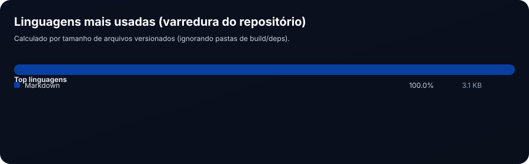

  
  
  
  
  
  

---

# Rubens Lyra

Engenheiro de Software com foco em **backend, arquitetura de sistemas e plataformas escaláveis**.
Atuação orientada a **segurança**, **padronização**, **manutenibilidade** e **ambientes corporativos**.

---

## Linguagens no Repositório (calculado do código do projeto)

> Este card é gerado a partir dos arquivos do próprio repositório (varredura por extensão),
> e é atualizado automaticamente via GitHub Actions.

  

---

## Foco Técnico

- Backend Architecture
- Secure APIs
- Authentication & Authorization
- Multitenancy
- Data Modeling & Migrations
- Production-ready systems

---

## Áreas de Atuação

- Desenvolvimento de APIs e serviços backend
- Arquitetura de sistemas distribuídos
- Autenticação e autorização
- Plataformas multitenant
- Integração com gateways de pagamento
- Sistemas orientados a domínio (DDD)

---

## Tecnologias Principais

**Backend**

- .NET (C#)
- PHP (Laravel)

**Bancos de Dados**

- PostgreSQL
- SQL Server
- MySQL

**Arquitetura & Práticas**

- Clean Architecture
- Domain-Driven Design (DDD)
- CQRS e Domain Events
- Separação de responsabilidades
- Configuração por ambiente

**DevOps**

- Docker
- Estruturação CI-friendly
- Ambientes isolados (dev / staging / prod)

---

## Sobre este Repositório

Este repositório funciona como um **hub profissional**, reunindo:

- Projetos públicos
- Arquiteturas de referência
- Estudos técnicos aplicados
- Soluções orientadas à produção

Cada projeto segue princípios de **clareza, segurança e padronização**, com documentação objetiva e foco em boas práticas.

---

## Filosofia Profissional

> Software deve ser previsível,
> sustentável por equipes
> e seguro por padrão.

---

## Contato Profissional

- GitHub: [rubenslyra](https://github.com/rubenslyra "github@rubenslyra")
- LinkedIn: [rubenslyra](https://www.linkedin.com/in/rubenslyra/ "linkedin@rubenslyra")

---

© Rubens Lyra
